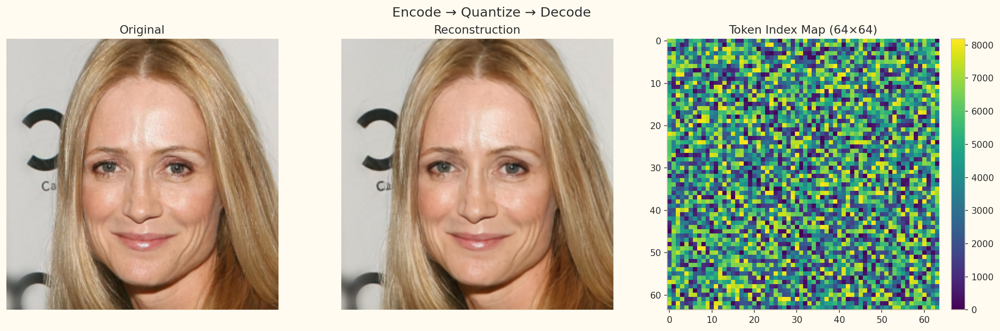
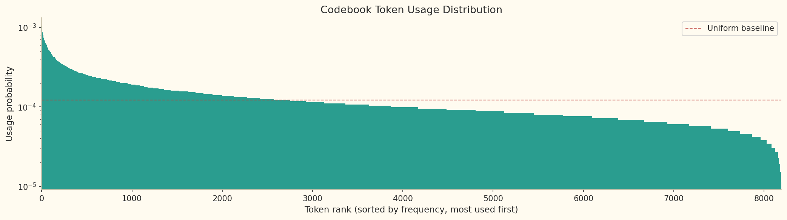
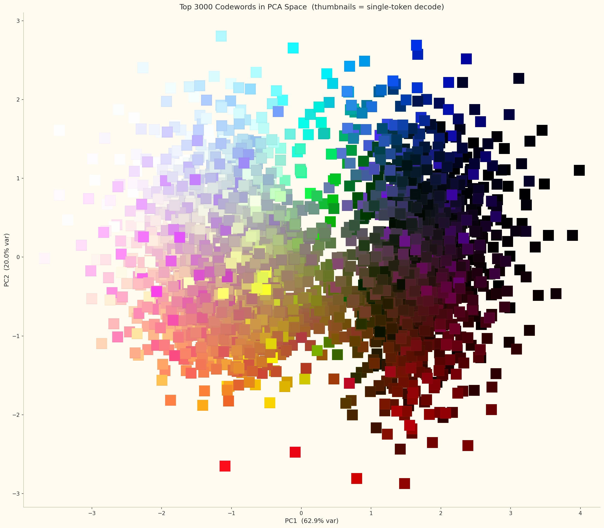
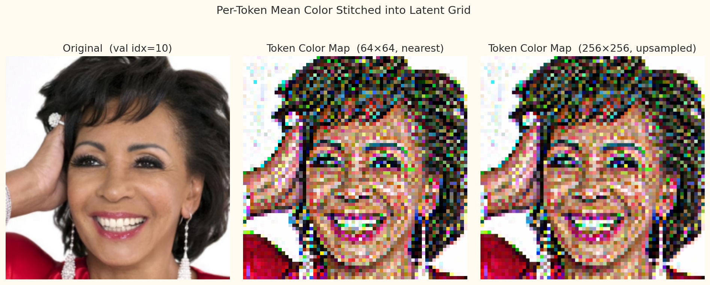
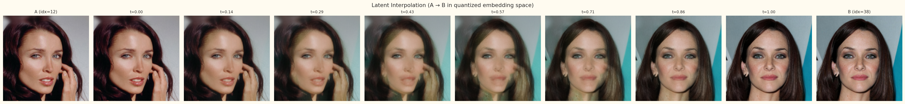

# μVQGAN

*Inspired by Esser et al.'s [Taming Transformers for High-Resolution Image Synthesis](https://compvis.github.io/taming-transformers/).*

A clean PyTorch implementation of a Vector Quantized GAN (VQGAN) image tokenizer, built on top of PyTorch Lightning. Trained on CelebA-HQ at 256×256 and designed as a first-stage encoder for latent diffusion models.

> **Note:** This repository is a personal study project aimed at reproducing and understanding image tokenization from the ground up. The goal is to build intuition for the VQ objective and the GAN training dynamics, not to provide a production-ready library.

## Results

### CelebA-HQ Reconstructions



*VQGAN (hidden\_dim=128, codebook\_size=8192, emb\_dim=3), trained with L1 + perceptual + codebook + adaptive adversarial loss for 180k steps. The token index map shows the 64×64 grid of discrete codes assigned to each spatial patch.*

### Codebook Analysis



*Token usage distribution over the validation set (log scale, sorted by frequency). The codebook is fully utilized with near-uniform coverage.*

| Metric | Value |
| --- | --- |
| Perplexity | 6777.4 / 8192 |
| Active tokens | 8192 / 8192 (100%) |
| Top-1 token share | 0.10% (uniform baseline: 0.012%) |

### Codebook Structure



*Top 3000 codewords projected into PCA space. Each thumbnail is the result of decoding a single token repeated across the full 64×64 grid — the smooth colour gradient confirms the codebook has learned a structured, semantically coherent embedding space.*

### Image Tokenization



*Per-token mean colour stitched back into a 64×64 grid and upsampled to 256×256. The spatial structure of the original image is preserved in the token map, showing that neighbouring patches share semantically similar codes.*

### Latent Space Interpolation



*Linear interpolation between two images in the latent space results in a smooth lerp between the two original images.*

## Features

- **Encoder–Decoder** backbone with ResNet blocks, RMSNorm scale-shift conditioning, and configurable multi-head self-attention
- **Vector Quantization** with straight-through estimator (STE), commitment loss, and perplexity / codebook-usage tracking
- **PatchGAN discriminator** (3-layer) with adaptive weight scaling that balances NLL loss against the adversarial loss using gradient magnitudes
- **Composite loss**: L1 reconstruction + VGG-based LPIPS perceptual + codebook + adaptive GAN (hinge), with a configurable warm-up before the discriminator kicks in
- **bf16-mixed precision** training and WandB integration with automatic reconstruction logging every N steps
- Config-driven training via [LightningCLI](https://lightning.ai/docs/pytorch/stable/cli/lightning_cli.html) — no code changes needed to swap hyperparameters

## Datasets

| Dataset | Resolution | Source |
| --- | --- | --- |
| CelebA-HQ | 256×256 | `mattymchen/celeba-hq` (HuggingFace) |

## Installation

Requires Python 3.14+ and [uv](https://docs.astral.sh/uv/).

```bash
git clone https://github.com/Soarxyn/micro-vqgan
cd micro-vqgan
uv sync
```

For GPU support (CUDA 13.0):

```bash
uv sync --extra-index-url https://download.pytorch.org/whl/cu130
```

## Training

Training is fully config-driven. The default preset targets CelebA-HQ at 256×256:

```bash
uv run python -m micro_vqgan fit --config config/celebahq.yaml
```

You can override any parameter directly from the command line:

```bash
uv run python -m micro_vqgan fit --config config/celebahq.yaml --model.lr 1e-4 --data.batch_size 16
```

Checkpoints are saved to `results/` and reconstructions are logged to WandB every 5 000 steps.

## Architecture

The model is a **convolutional encoder–decoder** with:

- Residual blocks with RMSNorm + scale-shift normalization
- Pixel-space downsampling (spatial rearrangement, no learned stride) and nearest-neighbour upsampling
- Multi-head self-attention (PyTorch SDPA backend) at configurable resolution levels, with zero-initialized output projections for stable early training
- A **Vector Quantization** bottleneck: 8 192-entry codebook with 3-dim embeddings, initialized with Kaiming uniform and trained end-to-end via the straight-through estimator

The discriminator is a **PatchGAN** (N-layer, default 3) with spectral normalization, LeakyReLU activations, and a hinge loss objective. An adaptive weight computed from the ratio of NLL-loss and GAN-loss gradients keeps the two objectives balanced throughout training.

## References

- P. Esser, R. Rombach, and B. Ommer, [Taming Transformers for High-Resolution Image Synthesis](https://arxiv.org/abs/2012.09841), CVPR, 2021.
- A. van den Oord, O. Vinyals, and K. Kavukcuoglu, [Neural Discrete Representation Learning](https://arxiv.org/abs/1711.00937), NeurIPS, 2017.
- R. Rombach, A. Blattmann, D. Lorenz, P. Esser, and B. Ommer, [High-Resolution Image Synthesis with Latent Diffusion Models](https://arxiv.org/abs/2112.10752), CVPR, 2022.
- I. Goodfellow et al., [Generative Adversarial Nets](https://arxiv.org/abs/1406.2661), NeurIPS, 2014.

## Acknowledgements

- [CompVis/taming-transformers](https://github.com/CompVis/taming-transformers) — the encoder, decoder, codebook, and discriminator designs are based on this repository (MIT License)
- [lucidrains/denoising-diffusion-pytorch](https://github.com/lucidrains/denoising-diffusion-pytorch) — reference for the attention and residual block implementations
